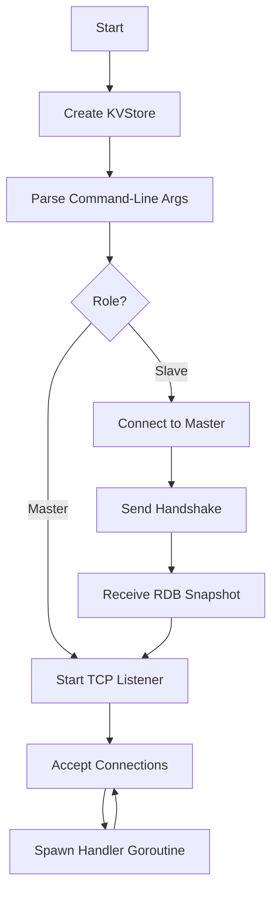

## Overview

ValKeyper is built as a concurrent TCP server that handles multiple client connections simultaneously. The architecture follows a clean separation of concerns with distinct components for networking, protocol handling, and data storage.

## Core Components

<CardGroup cols={2}>
  <Card title="TCP Server" icon="server">
    Handles client connections and request routing
  </Card>
  <Card title="RESP Parser" icon="code">
    Parses Redis Serialization Protocol messages
  </Card>
  <Card title="KV Store" icon="database">
    In-memory storage with expiry management
  </Card>
  <Card title="RDB Handler" icon="file">
    Persistence layer for data snapshots
  </Card>
</CardGroup>

## Server Architecture

The main server is implemented in `app/server.go` and follows a simple but effective pattern:

```go
// Initialize the key-value store
kvStore := store.New()
kvStore.ParseCommandLine()

// Start listening on TCP port
addr := fmt.Sprintf("0.0.0.0:%s", kvStore.Info.Port)
l, err := net.Listen("tcp", addr)

// Accept connections in a loop
for {
    conn, err := l.Accept()
    connection := store.Connection{
        Conn:       conn,
        TxnStarted: false,
        TxnQueue:   [][]string{},
    }
    rdr := resp.NewParser(conn)
    go kvStore.HandleConnection(connection, rdr)
}
```

### Connection Handling

Each client connection is handled in its own goroutine, enabling concurrent request processing:

<Steps>
  <Step title="Accept Connection">
    The server accepts a new TCP connection from a client
  </Step>
  <Step title="Create Parser">
    A RESP parser is created for the connection to handle protocol parsing
  </Step>
  <Step title="Spawn Goroutine">
    A new goroutine is launched to handle all commands from this client
  </Step>
  <Step title="Process Commands">
    Commands are parsed and executed in a loop until the connection closes
  </Step>
</Steps>

## Connection Structure

The `Connection` struct maintains per-connection state:

```go
type Connection struct {
    Conn       net.Conn    // The underlying TCP connection
    TxnStarted bool        // Whether a transaction is active
    TxnQueue   [][]string  // Queued commands in a transaction
}
```

This structure enables:
- **Transaction support** via MULTI/EXEC/DISCARD commands
- **Command queueing** for atomic execution
- **Stateful operations** per client

## Store Architecture

The `KVStore` struct (`app/store/store.go`) is the heart of the system:

```go
type KVStore struct {
    Info           Info                    // Server metadata and replication info
    store          map[string]string       // Main key-value storage
    expiryMap      map[string]chan int     // Expiry management channels
    AckCh          chan int                // Replication acknowledgment
    ProcessedWrite bool                    // Write tracking
    StreamXCh      chan []byte             // Stream notification channel
    Stream         map[string][]StreamEntry // Stream data structures
}
```

### Key Design Decisions

<AccordionGroup>
  <Accordion title="Concurrent Expiry Handling">
    Each key with an expiry time gets its own goroutine that waits on a timer. When the timer fires, the key is deleted. This approach is simple and leverages Go's lightweight goroutines, though it may not scale to millions of keys with expiries.

    ```go
    func (kv *KVStore) handleExpiry(timeout <-chan time.Time, key string) {
        closeCh := make(chan int)
        kv.expiryMap[key] = closeCh
        for {
            select {
            case <-closeCh:
                return
            case <-timeout:
                delete(kv.store, key)
            }
        }
    }
    ```
  </Accordion>

  <Accordion title="Replication Architecture">
    ValKeyper supports master-slave replication:

    - **Master nodes** maintain a list of connected slaves and forward write commands
    - **Slave nodes** connect to a master, perform a handshake, and receive commands
    - The `WAIT` command enables waiting for a minimum number of replicas to acknowledge writes

    ```go
    // Master forwards writes to all slaves
    if strings.ToUpper(buff[0]) == "SET" {
        for _, slave := range kv.Info.slaves {
            slave.Write(resp.ToArray(buff))
        }
    }
    ```
  </Accordion>

  <Accordion title="Stream Support">
    ValKeyper implements Redis Streams with:

    - Time-based IDs in the format `timestamp-sequence`
    - Automatic ID generation with `*` wildcard
    - Range queries via `XRANGE`
    - Blocking reads via `XREAD` with timeout support
    - Stream-to-stream notifications using channels
  </Accordion>
</AccordionGroup>

## Replication Info

The `Info` struct tracks replication state:

```go
type Info struct {
    Role             string      // "master" or "slave"
    MasterIP         string      // Master server IP (for slaves)
    MasterPort       string      // Master server port (for slaves)
    MasterReplId     string      // Replication ID
    MasterReplOffSet int         // Replication offset for tracking
    MasterConn       net.Conn    // Connection to master (for slaves)
    slaves           []net.Conn  // Connected slave connections (for masters)
    Port             string      // Server listening port
    flags            map[string]string // Command-line flags
}
```

## Command Processing Flow

<Steps>
  <Step title="Parse Command">
    The RESP parser extracts the command and arguments from the TCP stream
  </Step>
  <Step title="Check Transaction State">
    If a transaction is active (MULTI), commands are queued instead of executed
  </Step>
  <Step title="Execute Command">
    The command is dispatched through a large switch statement in `processCommand()`
  </Step>
  <Step title="Generate Response">
    A RESP-formatted response is generated based on the command result
  </Step>
  <Step title="Write Response">
    The response is written back to the client connection
  </Step>
  <Step title="Replicate (if master)">
    Write commands are forwarded to all connected slave nodes
  </Step>
</Steps>

<Note>
  The command processor uses a switch statement with over 20 cases, handling everything from simple commands like PING and ECHO to complex operations like XREAD and MULTI/EXEC transactions.
</Note>

## Concurrency Model

ValKeyper's concurrency model is based on Go's goroutines:

- **One goroutine per connection** handles all commands from a single client
- **One goroutine per expiring key** manages TTL expiration
- **Shared state protection** relies on Go's map access semantics (not explicitly mutex-protected)

<Warning>
  The current implementation does not use explicit locking for the shared `store` map. This works for the single-threaded nature of command processing per connection, but concurrent access patterns (like replication + client writes) may need additional synchronization in production scenarios.
</Warning>

## Initialization Flow



The initialization process includes:

1. Creating a new `KVStore` with default values (master role, port 6379)
2. Parsing command-line flags for configuration
3. Loading RDB file if `--dir` and `--dbfilename` are specified
4. Connecting to master if `--replicaof` is specified (slave mode)
5. Starting the TCP server and accepting connections
