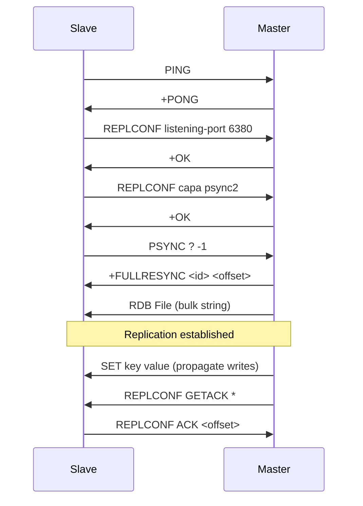

## Overview

ValKeyper supports Redis-compatible master-slave replication, allowing you to create replicas of your data across multiple nodes. This enables horizontal scaling for read operations and provides data redundancy.

## Master-Slave Architecture

In ValKeyper's replication model:

- **Master nodes** accept write operations and propagate changes to slaves
- **Slave nodes** replicate data from the master and serve read requests
- Replication is asynchronous by default

## Configuring Replication

### Starting a Slave Node

To configure a ValKeyper instance as a slave, use the `--replicaof` flag:

```bash
./your_program.sh --port 6380 --replicaof "127.0.0.1 6379"
```

This command starts a slave on port 6380 that replicates from a master at `127.0.0.1:6379`.

**Source reference:** `store.go:654-659`

```go
replicaof, ok := flags["replicaof"]
if ok {
    kv.Info.Role = "slave"
    kv.Info.MasterIP = strings.Split(replicaof, " ")[0]
    kv.Info.MasterPort = strings.Split(replicaof, " ")[1]
}
```

### Starting a Master Node

By default, any ValKeyper instance runs as a master:

```bash
./your_program.sh --port 6379
```

## Replication Handshake Process

When a slave connects to a master, it performs a three-phase handshake implemented in `HandleReplication()` and `SendHandshake()`.

<Steps>
  <Step title="Phase 1: PING">
    The slave sends a PING command to verify the master is responsive.
    
    ```go
    buff := []string{"PING"}
    master.Write([]byte(resp.ToArray(buff)))
    ```
    
    **Source:** `store.go:568-573`
  </Step>
  
  <Step title="Phase 2: REPLCONF">
    The slave sends two REPLCONF commands to exchange configuration:
    
    1. **Listening port**: Informs the master of the slave's port
    ```go
    buff = []string{"REPLCONF", "listening-port", kv.Info.Port}
    master.Write(resp.ToArray(buff))
    ```
    
    2. **Capabilities**: Declares support for PSYNC2 protocol
    ```go
    buff = []string{"REPLCONF", "capa", "psync2"}
    master.Write(resp.ToArray(buff))
    ```
    
    **Source:** `store.go:575-585`
  </Step>
  
  <Step title="Phase 3: PSYNC">
    The slave initiates synchronization with PSYNC command:
    
    ```go
    master.Write(resp.ToArray([]string{"PSYNC", "?", "-1"}))
    ```
    
    Using `?` and `-1` requests a full resynchronization. The master responds with:
    
    ```
    +FULLRESYNC <replication_id> <offset>\r\n
    ```
    
    **Source:** `store.go:587-598`
  </Step>
</Steps>

## PSYNC Protocol

### Master-Side PSYNC Handling

When the master receives a PSYNC command, it responds with a full resynchronization:

```go
case "PSYNC":
    res = []byte(fmt.Sprintf("+FULLRESYNC %s %d\r\n", 
        kv.Info.MasterReplId, kv.Info.MasterReplOffSet))
    
    rdbFile, err := hex.DecodeString("524544495330303131fa...")
    tmp := append([]byte(fmt.Sprintf("$%d\r\n", len(rdbFile))), rdbFile...)
    res = append(res, tmp...)
    kv.Info.slaves = append(kv.Info.slaves, connection.Conn)
```

**Source:** `store.go:264-277`

The master:
1. Sends the FULLRESYNC response with replication ID and offset
2. Transmits an RDB snapshot as a bulk string
3. Registers the connection as a slave

### RDB Transfer

After the handshake, the master sends an RDB file containing the current dataset:

```go
func expectRDBFile(p *resp.Parser) {
    byt, err := p.ReadByte()
    if string(byt) != "$" {
        return
    }
    n, err := p.GetLength()
    p.ReadBytes('\n')
    buff := make([]byte, n)
    io.ReadFull(p, buff)
}
```

**Source:** `store.go:601-622`

## Command Propagation

After initial sync, the master propagates write commands to all connected slaves:

```go
if strings.ToUpper(buff[0]) == "SET" {
    for _, slave := range kv.Info.slaves {
        slave.Write(resp.ToArray(buff))
    }
}
```

**Source:** `store.go:174-178`

<Note>
Only write commands (like SET) are propagated. Read commands are not forwarded to slaves.
</Note>

## Replication Offset Tracking

Slaves track their replication offset to maintain synchronization state:

```go
if kv.Info.Role == "slave" {
    kv.Info.MasterReplOffSet += len(resp.ToArray(buff))
}
```

**Source:** `store.go:161-171`

The offset is incremented by the byte length of each command received from the master.

## REPLCONF GETACK

Masters can query slaves for their current replication offset:

```go
case "REPLCONF":
    switch buff[1] {
    case "GETACK":
        res = resp.ToArray([]string{"REPLCONF", "ACK", 
            fmt.Sprintf("%d", kv.Info.MasterReplOffSet)})
```

**Source:** `store.go:254-257`

This is used by the WAIT command to ensure writes have been replicated.

## WAIT Command

The WAIT command blocks until a specified number of slaves acknowledge a write:

```go
case "WAIT":
    reqRepl, _ := strconv.Atoi(buff[1])  // Required replicas
    timeout, _ := strconv.Atoi(buff[2])  // Timeout in ms
    
    // Send GETACK to all slaves
    for _, slave := range kv.Info.slaves {
        slave.Write(resp.ToArray([]string{"REPLCONF", "GETACK", "*"}))
    }
    
    // Wait for acknowledgments
    acks := 0
    timeoutCh := time.After(time.Duration(timeout) * time.Millisecond)
    for acks < reqRepl {
        select {
        case <-kv.AckCh:
            acks++
        case <-timeoutCh:
            break
        }
    }
    res = []byte(fmt.Sprintf(":%d\r\n", acks))
```

**Source:** `store.go:278-303`

<Warning>
If no writes have been performed (empty store), WAIT immediately returns the number of connected slaves without querying them.
</Warning>

## Monitoring Replication

Use the INFO command to check replication status:

```bash
redis-cli INFO
```

Returns:
```
role:master
master_replid:8371b4fb1155b71f4a04d3e1bc3e18c4a990aeeb
master_repl_offset:0
```

**Source:** `store.go:247-253`

## Architecture Flow



## Best Practices

<AccordionGroup>
  <Accordion title="Network Configuration">
    Ensure slaves can reach the master on the specified IP and port. Firewall rules should allow TCP connections on the replication port.
  </Accordion>
  
  <Accordion title="Monitoring Lag">
    Regularly check replication offsets on slaves to detect lag. Use the INFO command to compare master and slave offsets.
  </Accordion>
  
  <Accordion title="Failover Planning">
    ValKeyper does not provide automatic failover. You'll need to manually promote a slave to master during failures.
  </Accordion>
</AccordionGroup>